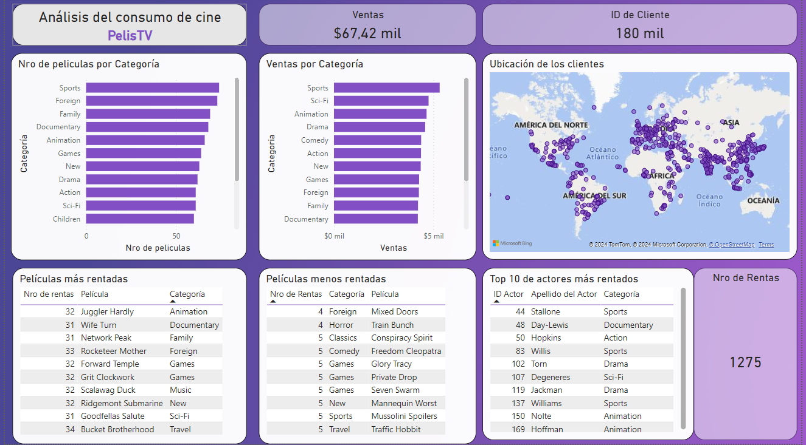

# Reporte de consumo de una plataforma de alquiler de películas

##Descripción

Es una empresa ficticia donde se analizan aspectos del consumo de los clientes, utilizando herramientas de POWER BI como transformar datos en Power Query, filtros para cada objeto visual, relaciones entre las tablas del modelo (origen de datos postgresql como direct querys e importando tablas). Se buscó obtener aspectos como en que categorías se tienen mas existencias en relación a las que se venden más, características del consumo de los usuarios a partir de las películas más y menos rentadas y a que categoría pertenecen, así como los actores más populares y la dispersión de los clientes a nivel mundial. De esta manera, se pueden direccionar más eficientemente nuevas inversiones en el rubro en aquellas categorías, tipos de películas y actores más buscados por los clientes.

