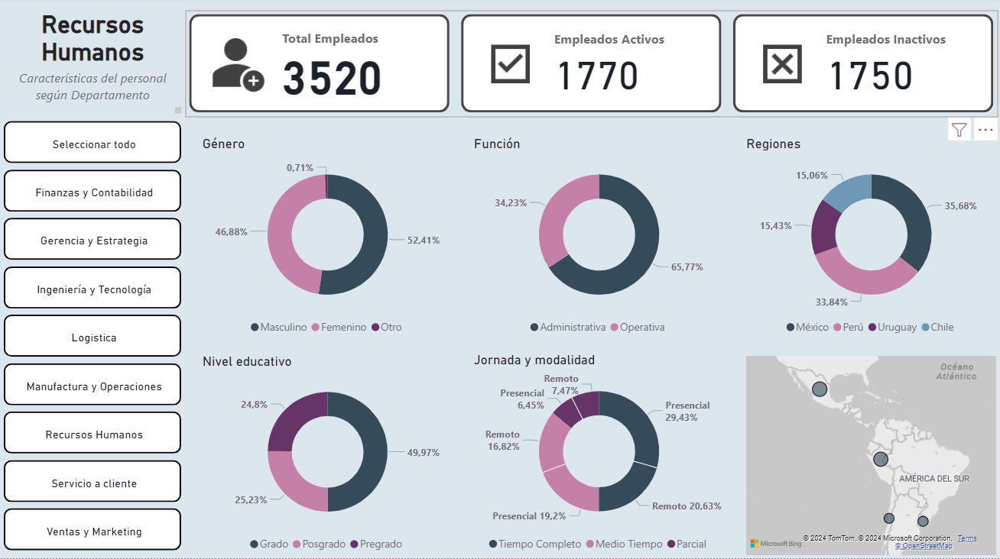

# Panel de Reporte de RRHH

##Descripción

Es una empresa ficticia donde se analizan diferentes aspectos de los RRHH de la misma, los cuales se pueden filtrar tanto de los propios objetos visuales como del segmentador incluído. Los cálculos fueron realizados tanto en medidas implícitas como en medidas explícitas DAX.

