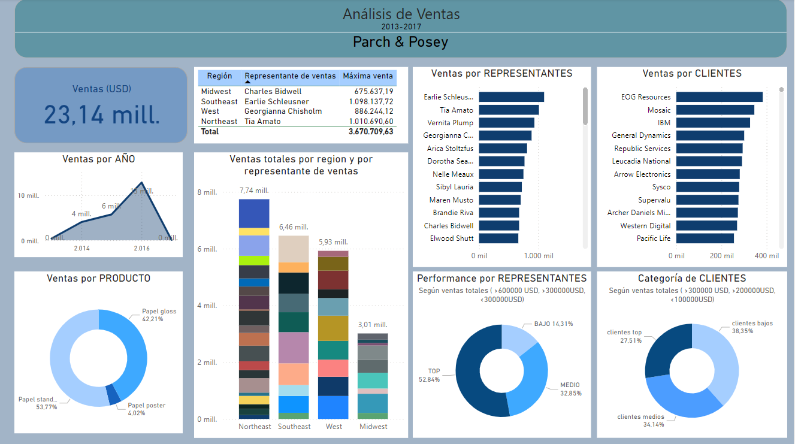

# Panel de Análisis de Ventas de Parch & Posey

##Descripción

Es una empresa ficticia que vende papel, los datos fueron extraídos del curso de SQL de Udacity. Se utilizaron querys en PostgreSQL que luego se importaron en POWER BI para realizar el dashboard.

